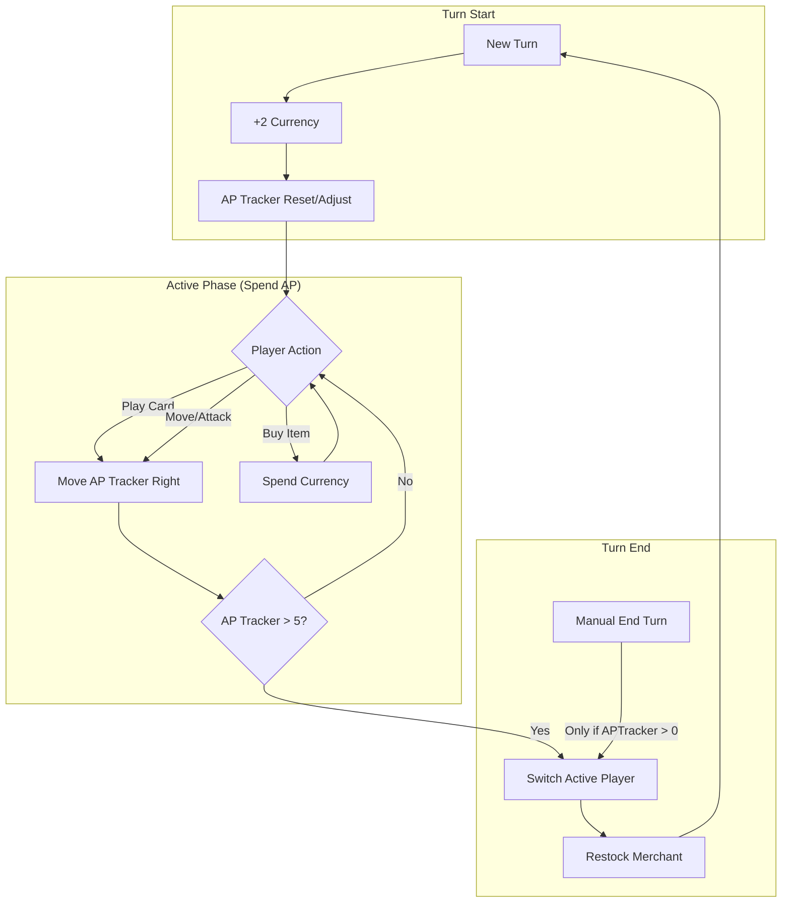

# MVP Prototype Plan: "Blue Theta Seven"

This plan outlines the requirements for a functional prototype to test the core "Tug-of-War" and "Merchant" mechanics.

## 1. Core Objectives

- Validate the **AP Tracker** turn-switching loop.
- Test the friction between **AP** (tactical) and **Currency** (strategic).
- Verify the "living board" feel of placing hex tiles.

## 2. Technical Stack

- **Engine:** Godot 4.x (as per project structure).
- **Language:** GDScript.
- **Visuals:** Simple 2D sprites (Hexagons, Circles for Entities) and a clean UI.

## 3. Scope of MVP

### Phase 1: The Foundation

- **Hex Grid:** A simple coordinate system (Axial or Offset) for tile placement.
- **The AP Tracker UI:** A horizontal slider representing the Tug-of-War track.
- **Turn Logic:** A system to track Active Player, AP, and Currency.

### Phase 2: Action Economy

- **AP Spending:**
  - `Move`: Click entity -> Click adjacent hex (-1 AP).
  - `Play Tile`: Select tile card -> Click empty adjacent slot (-X AP).
- **The Turn Switch:**
  - Automatic switch when AP Tracker reaches `[Value: 5]`.
  - Manual "End Turn" button (only active if AP Tracker is on opponent's side).

### Phase 3: The Merchant & Items

- **Market Row:** A UI panel showing 3 random "Item" buttons.
- **Currency:** Players gain `[Value: 2]` currency at start of turn.
- **Equipping:** Clicking a Merchant item deducts currency and adds a stat buff (e.g., +1 Attack) to a selected entity.

### Phase 4: Basic Combat

- **Resolution:** A simple "Roll vs Defense" logic.
- **Visuals:** Floating combat text (e.g., "-2 HP").

## 4. Visualizing the System (Mermaid)

## 5. Success Criteria

- Can a player place 3 tiles and an entity before the turn switches?
- Does saving currency for a Merchant item feel like a meaningful choice compared to spending AP?
- Is the Tug-of-War visual intuitive for tracking "whose turn is it?"
